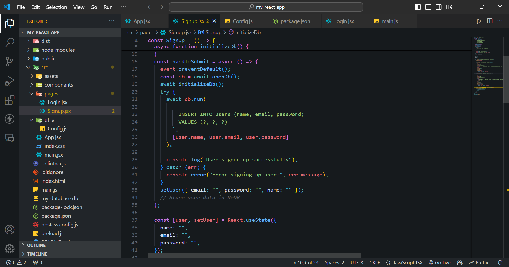

# shadow-code

## Project Description

**shadow-code** is a tool designed to enhance coding productivity with a customizable theme. It provides a visually appealing and functional coding environment to make development more enjoyable.

## Features

- **Customizable Themes**: Choose and apply various themes to suit your coding preferences.
- **High Contrast Mode**: Enhance visibility with a high contrast mode.
- **Supports Multiple Languages**: Compatible with various coding languages.

## Screenshot

## License

This project is licensed under the MIT License - see the [LICENSE](https://opensource.org/license/mit) file for details.

## Acknowledgments

- Thanks to [Visual Studio Code](https://code.visualstudio.com/) for their excellent Markdown support.
- Thanks to [GitHub](https://github.com/) for providing a platform for open-source collaboration.
